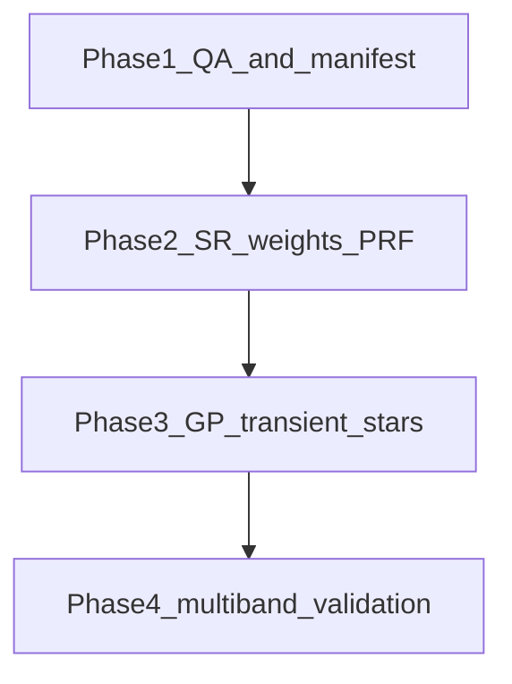

# Suggested order to fix / deliver publication blockers

This orders **engineering work** (GitHub issues in [`docs/github_issues/ISSUES_FOR_GITHUB.md`](github_issues/ISSUES_FOR_GITHUB.md)) and **analysis studies** (sections in [`docs/PUBLICATION_READINESS.md`](PUBLICATION_READINESS.md)) so dependencies are respected. Adjust if your paper’s deadline stresses calibration over multi-band.

## Principles

1. **Truth in labeling** — Clarify limits of the current code (mixed-channel behavior, MAP uncertainties) before heavy science conclusions.
2. **Forward model first** — PRF, weights, and masks must be trustworthy before tuning GP complexity.
3. **Cheap ablations before big features** — SR sweep and transient aggregation studies inform whether joint Ch1+Ch2 is worth the effort.

---

## Phase 1 — Baseline honesty and tooling (short)

| Order | Item | Issue / checklist | Why first |
|-------|------|-------------------|-----------|
| 1.1 | **Single-channel ambiguity** | BUG-3, Publ. G (calibration path) | Wrong band mix invalidates all fluxes. |
| 1.2 | **WCS warning cleanup** | BUG-1 | Restores log signal for real problems. |
| 1.3 | **Run manifest** | FR-7, Publ. H (reproducibility) | Every later run is citeable. |
| 1.4 | **Pytest smoke / markers** | BUG-2 | Safe refactors for solver/GP. |

### Phase 1 — completion status

| # | Done | What was implemented |
|---|:----:|---------------------|
| **1.1** | ☑ | **`chan_str`** comes from **`config.CHANNEL`** (no longer inferred from the template FITS path). **`find_spitzer_files`** prints how many `*cbcd.fits` match the configured band vs total found. **README** documents single-band behavior and that mixed-channel files are skipped. Config adds **`FLOAT_NUCLEAR_POINT_POSITION`**, **`NUCLEAR_POINT_POS_RIDGE`**, **`GP_COMPONENTS_NONNEGATIVE`** so tests can patch flags without `AttributeError`. |
| **1.2** | ☑ | **`src/solver.py`**: `warnings.filterwarnings` for redundant Astropy **CD vs CDELT** (`RuntimeWarning` / `UserWarning`, message pattern). **`pytest.ini`**: same filter + documents intent. **Related (BUG‑1b / projection cache):** **`_sip_distortion_fingerprint`** + **`_wcs_projection_cache_key`** so **`_PROJECTION_CACHE`** keys include SIP polynomial hashes; **`tests/test_wcs_projection_distortion.py`**; optional **`scripts/verify_cbcd_sip_headers.py`** for raw FITS under **`DATA_DIR`**. |
| **1.3** | ☑ | **`src/run_manifest.py`**: builds **`run_manifest.json`** with schema `spitzer_photometry.run_manifest.v1`, git SHA/dirty, Python + key package versions, full **`config` snapshot**, sorted input CBCD paths. **`pipeline_fit.run_pipeline_fit_core`** writes **`OUTPUT_DIR/run_manifest.json`** after a successful solve (extras: `chan_str`, epoch/cutout counts). **`tests/test_run_manifest.py`**. README points to the manifest. |
| **1.4** | ☑ | **`pytest.ini`**: register **`slow`** marker. **`tests/test_iterative_native_fit.py`** and **`tests/test_native_fit_n_bcds.py`** marked **`@pytest.mark.slow`**. **`tests/test_prf_resolution_independence.py`**: module-level **`pytest.mark.slow`**. **`TestNullGP`** marked slow. **README**: `pytest -m "not slow"` vs full suite. **`.github/workflows/pytest.yml`**: CI runs **`pytest -m "not slow"`**. **Supporting:** **`GP_KERNEL_TYPE`** / **`GP_DIAGONAL_EPS`** + diagonal branch in **`gp_model.build_scene_prior_inverse`** (tests expected it); **`test_phase0_math_checks.py`** updated for current solver strings (`mask_cov` / `ltwl_diag_cap`); **`TestNuclearPointSourcePositionFloat`** **`skip`** until solver exposes **`nuclear_point_dra_deg`** / **`ddec`**. |

### Related documentation

- **[`docs/PUBLICATION_READINESS.md`](PUBLICATION_READINESS.md)** — Short paragraph (Section H area): native pixel→sky uses full Astropy **`WCS`** (SIP when present); scene grid is linear **`RA---TAN`/`DEC--TAN`**; CD/CDELT warnings are about redundant linear keywords, not dropping SIP.

---

## Phase 2 — Forward model & weights (medium)

| Order | Item | Issue / checklist | Why here |
|-------|------|-------------------|----------|
| 2.1 | **SR / ROI convergence study** | FR-4, Publ. D | Fixes grid/PRF resolution before arguing about GP texture. |
| 2.2 | **Nuclear weights / variance** | FR-2, Publ. B | Stabilizes core residuals; informs whether GP needs more freedom there. |
| 2.3 | **P-map / PRF options audit** | Publ. G | Document `PRF_APPLY_PMAP_GAIN`, `PRF_ORDER_*`, anchors for the paper. |

---

## Phase 3 — Scene model & transient (longer)

| Order | Item | Issue / checklist | Why here |
|-------|------|-------------------|----------|
| 3.1 | **GP vs independent baseline + hyperparams** | Publ. A, FR-6 (uncertainties) | Needs stable weights (Phase 2). |
| 3.2 | **Stars vs GP leakage tests** | FR-5, Publ. E | After GP path is defined; stars compete with extended emission. |
| 3.3 | **Transient: per-epoch vs per-BCD study** | FR-3, Publ. C | Uses finalized weighting and SR choice. |

---

## Phase 4 — Multi-band and polish (largest)

| Order | Item | Issue / checklist | Why last |
|-------|------|-------------------|----------|
| 4.1 | **Joint Ch1 + Ch2 (+ covariance)** | FR-1, Publ. F | Depends on single-band pipeline being correct and documented. |
| 4.2 | **External validation subset** | Publ. G (SSC / aperture) | Compare apples-to-apples once bands and PSF are settled. |
| 4.3 | **Held-out epochs** | Publ. H | Final generalization check. |

---

## Mermaid overview

---

## Mapping: GitHub issue → phase

| Issue | Phase |
|-------|--------|
| BUG-3 | 1 |
| BUG-1 | 1 |
| FR-7 | 1 |
| BUG-2 | 1 |
| FR-4 | 2 |
| FR-2 | 2 |
| FR-5 | 3 |
| FR-3 | 3 |
| Publ. A (GP) | 3 |
| FR-6 | 3 |
| FR-1 | 4 |
